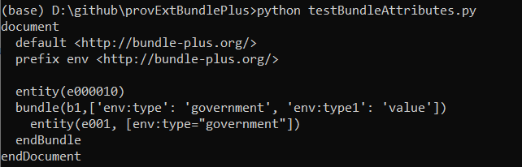

# ProvExtension
 Extending PROV for data environment representation
 
 Open testBundleAttributes file from src/prov folder or 
rune file on command prompt as  python testBundleAttributes.py
The output file should be like this

